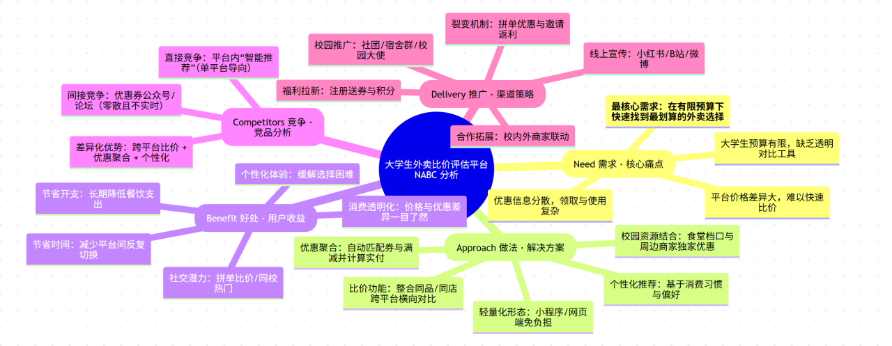
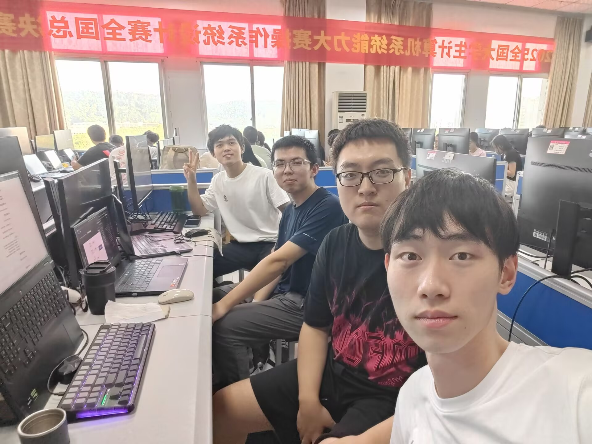

# 软件工程定项第一次会议记录

**参会者**：周宇童，丁琦扬，张筱坤，范思语  
**时间**：2025年9月16号 南一楼项目选择

## 项目选择

大学生外卖比价评估平台

## 项目分析

1. 现有外卖平台的不足：

   1. 平台价格差异大，难以快速比价

   2. 优惠信息分散，领取与使用复杂

   3. 大学生预算有限，缺乏透明对比工具

2. 改进方式
	1. 比价功能：整合同品/同店跨平台横向对比
	
	2. 优惠聚合：自动匹配券与满减并计算实付
	
	3. 个性化推荐：基于消费习惯与偏好
	
	4. 轻量化形态：小程序/网页端免负担
	
	5. 校园资源结合：食堂档口与周边商家独家优惠

## 思维导图

## 会议图片

